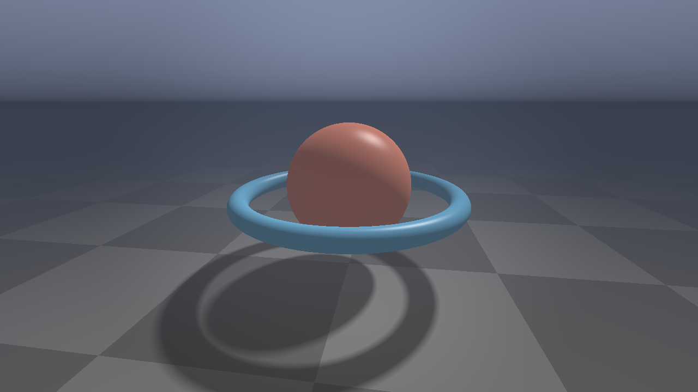

# GoGL - Professional OpenGL Shader Library for Go

A high-performance, cross-platform OpenGL shader library for Go with clean APIs, comprehensive error handling, and a production-ready GLSL shader collection.



> The screenshot above is generated headlessly in CI from a single fragment shader (`shaders/fragment/raymarch_showcase.frag`) driven by ~150 lines of host code in [`cmd/examples/showcase`](cmd/examples/showcase). Reproduce locally with `go run ./cmd/examples/showcase`.

## Features

- **Shader Management** - Compile, link, and validate vertex, fragment, geometry, and compute shaders with robust error reporting
- **Pipeline State** - Builder-pattern rendering state management with optimized state caching to minimize GL calls
- **Resource Management** - VBO, IBO, UBO, VAO, texture, and mesh lifecycle management with object pooling
- **Platform Detection** - Automatic GPU vendor detection, OpenGL version parsing, and capability queries
- **28 Production GLSL Shaders** - Vertex, fragment, geometry, and compute shaders for common rendering scenarios

## Quick Start

```bash
go get github.com/yossideutsch1973/gogl
```

```go
package main

import (
    "github.com/yossideutsch1973/gogl/pkg/shader"
    "github.com/yossideutsch1973/gogl/pkg/pipeline"
    "github.com/yossideutsch1973/gogl/pkg/resource"
)

func main() {
    // Compile shaders
    vs, _ := shader.CompileShader(vertexSrc, shader.VertexShader)
    fs, _ := shader.CompileShader(fragmentSrc, shader.FragmentShader)
    defer vs.Delete()
    defer fs.Delete()

    // Create program
    prog, _ := shader.CreateProgram(vs, fs)
    defer prog.Delete()

    // Set up pipeline state
    state := pipeline.NewBuilder().
        WithProgram(prog).
        WithDepthTest(true, true, pipeline.DepthLess).
        WithBlending(false, pipeline.BlendSrcAlpha, pipeline.BlendOneMinusSrcAlpha).
        WithViewport(0, 0, 1920, 1080).
        Build()

    p := pipeline.New()
    p.SetState(state)

    // Create a mesh
    layout := resource.NewVertexLayout().AddFloat(0, 3).AddFloat(1, 2)
    mesh, _ := resource.NewMesh(vertices, indices, layout)
    defer mesh.Delete()
}
```

Run the included examples:

```bash
go run ./cmd/examples/basic      # spinning interpolated-color triangle
go run ./cmd/examples/showcase   # fullscreen raymarched scene (pictured above)
```

## Shader Library

28 production-ready GLSL shaders organized by type:

| Type | Count | Examples |
|------|-------|---------|
| Vertex | 8 | Basic, textured, Phong, skybox, screen quad, fullscreen triangle |
| Fragment | 13 | Lighting, blur, edge detection, gamma correction, grayscale |
| Geometry | 5 | Point expansion, wireframe, normal visualization, explosion |
| Compute | 2 | Particle simulation, image processing (OpenGL 4.3+) |

See [`shaders/README.md`](shaders/README.md) for full documentation.

## Package Overview

```
pkg/
├── shader/      Shader compilation, linking, program management
├── pipeline/    Rendering state management with builder pattern
└── resource/    Buffer, texture, VAO, mesh lifecycle management

internal/
└── platform/    GPU detection and capability queries

shaders/         28 production GLSL shaders
cmd/examples/    Working demo applications
```

### `pkg/shader`

- `CompileShader(source, type)` / `CompileShaderFromFile(path, type)` - Compile GLSL shaders
- `CreateProgram(shaders...)` - Link shaders into a program
- `SetUniform*` methods - Type-safe uniform setting with validation
- `DispatchCompute` / `MemoryBarrier` - Compute shader support

### `pkg/pipeline`

- `New()` - Create a pipeline with sensible defaults
- `NewBuilder()` - Fluent builder for state configuration
- `PushState()` / `PopState()` - State stack for scoped changes
- Optimized state caching (only issues GL calls when state actually changes)

### `pkg/resource`

- `NewVertexBuffer` / `NewIndexBuffer` / `NewUniformBuffer` - Buffer creation
- `NewVertexArray` / `NewVertexLayout` - VAO and attribute configuration
- `NewMesh` - Combined VBO/IBO/VAO mesh abstraction
- `NewTexture2D` / `NewTextureArray` / `NewTextureManager` - Texture management
- `NewBufferPool` - Object pooling for buffer reuse

## Platform Support

| Platform | OpenGL | CI |
|----------|--------|-------|
| Linux    | 4.1 (Mesa llvmpipe) | tests + screenshot render under Xvfb |
| macOS    | 4.1 | build verified on `macos-latest` |
| Windows  | 4.1 | build verified on `windows-latest` |

**Note:** macOS is limited to OpenGL 4.1 (compute shaders unavailable). The library uses OpenGL 4.1 as its baseline for maximum compatibility. GitHub-hosted macOS/Windows runners have no display, so those CI jobs build-verify only; the Linux job runs the full unit-test suite and renders the showcase PNG as a build artifact.

## Testing

```bash
go test ./tests/unit/...
```

Tests require an OpenGL context (GLFW window). In CI, tests run under Xvfb with Mesa's software renderer.

## Dependencies

- [go-gl/gl](https://github.com/go-gl/gl) - OpenGL 4.1 core bindings
- [go-gl/glfw](https://github.com/go-gl/glfw) - Window/input management
- [go-gl/mathgl](https://github.com/go-gl/mathgl) - 3D mathematics

## License

MIT
